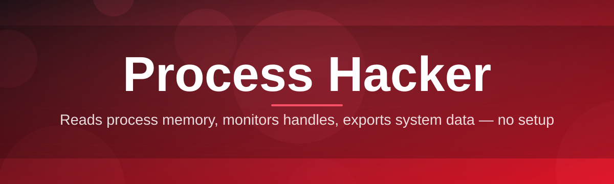
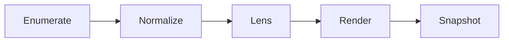

# ph-optimizer 🚀🔍

  

*A weekend-project-turned-toolkit that gives Process Hacker workflows a modern, opinionated tune-up.*

---

## ⚡ Three Steps and You're In

1. Grab the latest build from the landing page button below.

2. Unzip it anywhere — no installer, no wizard, no fuss.

3. Double-click `ph-optimizer.exe` and start inspecting processes like you mean it.

That's genuinely it. Everything past this point is just us nerding out about *why* we built it this way.

---

## 🧭 Overview

`ph-optimizer` started as a scrappy weekend build born out of frustration: process explorers in Windows are either too shallow (Task Manager) or too dense for quick triage (raw Process Hacker without a game plan). This project sits in between — it wraps around the spirit of Process Hacker's deep system introspection (handles, threads, modules, services, network sockets) and layers on smarter defaults, presets, and a friendlier lens for reading what your machine is actually doing.

We built this for the people who live inside `taskmgr` replacements every day: sysadmins triaging a runaway service at 2 AM, developers hunting a memory leak in their own app, curious tinkerers who want to understand what that mystery `.exe` is doing with their network stack, and performance nerds who treat their PC like a garden that needs pruning. If you've ever right-clicked a process and thought "I wish this told me *more*, faster" — this is aimed squarely at you.

This isn't a rewrite of Process Hacker, and it isn't trying to replace the giants of the process-monitoring space. Think of it as a co-pilot: a companion tool tuned for quick diagnostics, handle-leak spotting, and service-level sanity checks, wrapped in a UI that doesn't make you squint. Windows-only, portable, zero telemetry by default, and — importantly — built by one person over some weekends who just wanted this tool to exist.

  

---

## 🔥 What Makes It Tick

- **Handle X-Ray Vision** — dig past the surface list of open handles and see which ones are quietly pinning memory or file locks that a normal reboot won't clear.

- **Service Sanity Sweeper** — a dedicated lens for Windows services that flags orphaned, stuck-in-limbo, or suspiciously CPU-hungry background services before they become a 3 AM page.

- **Thread Stack Storyteller** — turns a wall of thread IDs into a readable narrative of what a process's threads are actually blocked on or waiting for.

- **Network Socket Ledger** — a live accounting of every TCP/UDP connection tied to a process, so "what's phoning home" stops being a mystery.

- **Priority & Affinity Presets** — one-click profiles for gaming, background-render, or battery-saver scenarios instead of manually juggling sliders every time.

- **Startup Impact Rankings** — a weighted score of what's actually slowing your boot, not just a raw list of everything set to auto-start.

- **Module & DLL Footprint Map** — visualize which loaded modules are shared across processes versus which ones are oddly process-specific.

- **Snapshot Diffing** — capture two points in time and diff them, so you can actually *prove* what changed after that update or install.

> [!TIP]
> Pin your three most-used lenses (Handles, Services, Network) to the sidebar — it turns triage from a five-click hunt into a glance.

---

## 🌱 How to Get Started

1. **Visit the landing page** — click the big download badge anywhere in this README.

2. **Download the portable build** — no installer, no admin prompt required for the base experience (some deep inspection features will ask for elevation, which is normal for Process Hacker–style tooling).

3. **Run it** — extract the archive, launch `ph-optimizer.exe`, and let the first-run scan populate your process tree.

4. **Explore a preset view** — start with the "Quick Triage" layout in the top-left dropdown; it's the friendliest on-ramp for first-time users.

> [!NOTE]
> Windows Defender or SmartScreen may flag a first run simply because the binary is new and unsigned by a big vendor. This is expected behavior for indie tools — check the landing page for verification steps if you want extra peace of mind.

---

## 📋 System Requirements

| OS | RAM | Disk |
|---|---|---|
| Windows 10 (64-bit, build 19041+) | 4 GB minimum, 8 GB comfy | 150 MB free space |
| Windows 11 (all supported builds) | 4 GB minimum, 8 GB comfy | 150 MB free space |
| Windows Server 2019/2022 (best-effort support) | 8 GB recommended | 200 MB free space |

Standalone binary. No .NET installer, no runtime downloads, no background services left behind after you delete the folder.

---

## 🛠️ How It Works

The architecture is deliberately simple — a weekend project doesn't get to have fifteen microservices.

1. **Enumeration Layer** grabs the live process list, handle tables, and service registry via native Windows APIs.

2. **Normalization Pass** cleans and cross-references raw kernel data into something structured and query-able.

3. **Lens Engine** applies whichever view you've selected (Handles, Services, Network, etc.) to the normalized dataset.

4. **Render Layer** paints the results into the UI, diffable and filterable in real time.

5. **Snapshot Store** optionally persists a point-in-time capture locally for later comparison — nothing leaves your machine.

> [!IMPORTANT]
> The Snapshot Store is opt-in and purely local. `ph-optimizer` does not phone home, does not upload process data, and has no analytics pipeline baked in.

---

## 🧩 Troubleshooting

<strong>Why does a process show "Access Denied" when I try to inspect its handles?</strong>

Certain system and protected processes require elevated privileges to enumerate handles. Right-click the app shortcut and choose "Run as administrator," then relaunch the scan.

<strong>The Network Socket Ledger is empty for a process I know has connections.</strong>

This usually means the process is sandboxed or running under a different session context (common with UWP apps or containerized services). Try enabling "Cross-session view" in Settings → Advanced.

<strong>My antivirus quarantined the executable.</strong>

This is common for new, unsigned indie binaries. Restore it from quarantine and add an exclusion for the extracted folder if your AV allows it. Always verify you downloaded from the official landing page.

<strong>Startup Impact Rankings look different from what Task Manager shows.</strong>

Task Manager measures raw boot-time impact heuristically; our ranking weighs CPU, disk I/O, and delayed-start service chains together, so the ordering can legitimately differ.

<strong>Can I run this alongside the original Process Hacker or similar tools?</strong>

Yes — `ph-optimizer` reads from the same kernel-level Windows APIs and doesn't lock resources exclusively, so running it side-by-side with other monitoring tools is completely safe.

---

## 🎨 UI / UX Details

`ph-optimizer` ships with a handful of quality-of-life touches that we, frankly, built because we wanted them for ourselves.

| Shortcut | Action |
|---|---|
| `Ctrl+F` | Focus the process search bar |
| `Ctrl+K` | Open the command palette |
| `F5` | Force a full re-scan |
| `Ctrl+D` | Toggle diff mode against last snapshot |
| `Ctrl+,` | Open Settings |
| `Alt+1` – `Alt+4` | Switch between lens views |

- **Themes**: Midnight (default dark), Paper (light), and High-Contrast for accessibility.

- **Settings** persist to a local config file — no registry writes, no hidden AppData surprises beyond that one file.

- **Layout memory**: the app remembers your last lens, window size, and column widths between sessions.

> [!WARNING]
> Diff mode compares snapshots by PID and creation timestamp — if a process restarted between captures, it will show as a "new" entry rather than a continuation. This is expected and matches how the underlying OS treats process identity.

  

---

## 🤝 Contributing & Community

This project runs on weekend energy and community goodwill — every contribution, no matter how small, genuinely moves the needle.

> [!TIP]
> New here? Look for issues tagged `good-first-issue` — they're specifically curated to be approachable, well-scoped, and mentored. We'd love for your first pull request ever to be to this repo.

- Found a bug in a lens view? Open an issue with your Windows build number and repro steps.

- Got an idea for a new preset or a sharper metric? Start a discussion thread before diving into code — we love bouncing ideas around.

- Documentation improvements are just as valuable as code — typo fixes, clearer wording, better screenshots, all welcome.

> [!NOTE]
> There's no formal CLA and no gatekeeping ceremony. Fork it, branch it, PR it. We review fast because this is a passion project, not a corporate backlog.

---

## 📜 License

Released under the [MIT License](LICENSE), 2026. Do genuinely cool things with it — just keep the license notice intact.

---

## ⚠️ Disclaimer

`ph-optimizer` is an independent community project inspired by the broader Process Hacker ecosystem and is not affiliated with, endorsed by, or officially connected to the original Process Hacker maintainers or trademark holders. It is provided "as is," without warranty of any kind. Deep system inspection tools interact closely with kernel-level data — use good judgment, keep backups current, and always download from the official landing page linked in this repository.

  

